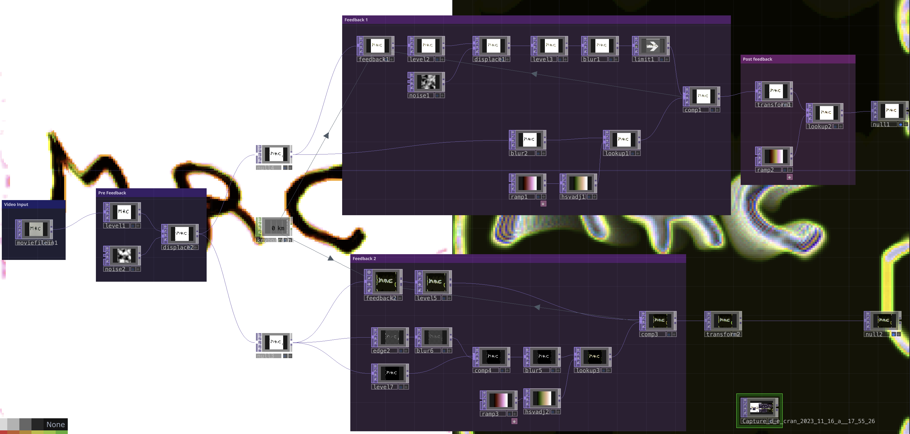

# Touchdesigner Text Feedback

**On how to modify with a video with feedback effects.**

Template file to download : feedback_video_text.toe

## To begin with

- My [Introduction to Touchdesigner](https://github.com/LucieMrc/IntroTD)

- Intro + tutorial about [Feedback loop in TD (EN)](https://github.com/LucieMrc/TD_feedback_love_EN)

## The template

The template is showing you two examples of feedback look, + pre feedback and post feedback nodes.

# To go further

# TD_textFeedback
