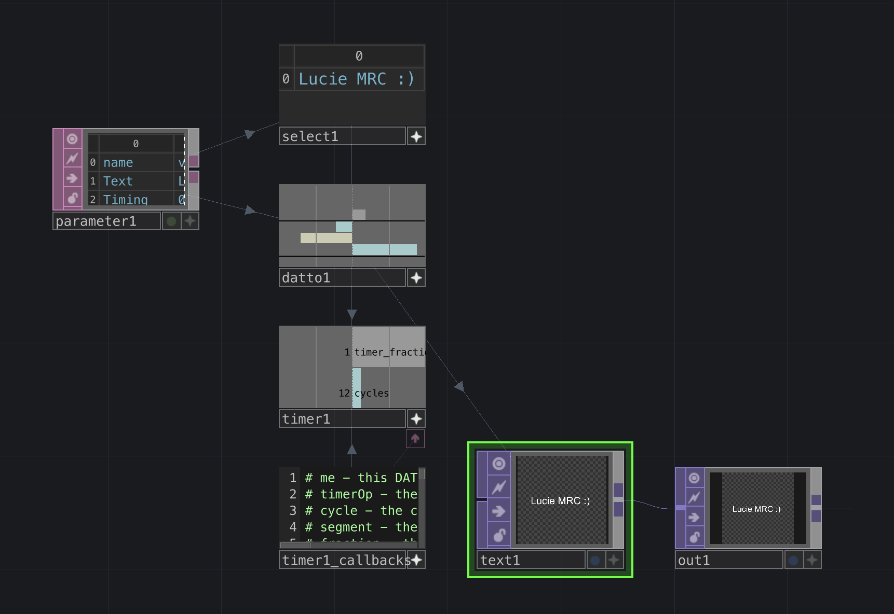

# Touchdesigner Text Effects

**On how to play around with text with Touchdesigner effects.**

* [1. Text letter by letter](#1-Text-letter-by-letter)
* [2. Text distortion on 3D objects](#2-Text-distortion-on-3D-objects)
* [3. Text Feedback](#3-Text-Feedback)
* [To go further](#to-go-further-if-you-understand-touchdesigner)

## To begin with

- My [Introduction to Touchdesigner](https://github.com/LucieMrc/IntroTD)

- Intro + tutorial about [Feedback loop in TD (EN)](https://github.com/LucieMrc/TD_feedback_love_EN).

# 1. Text letter by letter

Template file to download : **letterbyletter.toe**

## The template

The template is showing you a very basic animation of a word or group of words appearing letter by letter.

All the magic is happening inside a custom base named LetterByLetter, with an `Out` TOP to display and modify the result.

In the parameters of the base, there is a `Parameters` page where we can input the text, change the delay between the letters (in seconds). We can also choose the X and Y position of the text, and the font size.

To start the animation, we click on the `Start` pulse button.

The `Start` button is linked to a `Keyboard In` CHOP to also start the animation when we press "q".

## Inside the base

If you look inside the `LetterByLetter` base, there is a `Parameter` DAT, `Select` DAT and `DAT to` CHOP to get informations from the parameters page of the base, a `Timer` CHOP to start and choose the timing of the animation, and a `Text` TOP going into an `Out` TOP to display and output the text.

The only things you should really modify here are the `Text` TOP parameters, and mostly the `Font` page and and the `Common` page to change the resolution.

# 2. Text distortion on 3D objects

Template file to download : **curvedText.toe**

## The template

There are 4 animation bases in the template, a `Table` DAT for your text, a `Switch` TOP to switch between the different animation bases outputs to display in the `Out` TOP.

By clicking on the little star on the bottom right of the `Table` DAT, you can modify the text in the node, and it will change in each animation bases, and its size should adapt.

You can choose which base you want to display by changing the `Index` in the `Switch` TOP parameters.

The speed of each animation base can be modified in the Parameters of the node.

## Inside the base : Text on a circle

The DAT nodes (green) are used to get the parameters of animation time and numbers of letters.

The SOP nodes (blue) are used to create the circle, modify it, and create the text in 3D. Then, it curves the text following the circle using the `Creep` SOP and makes it moving around the circle.

The 3D model then goes through a `Geo` COMP to be rendered in a `Render` TOP.

## Inside the base : Text in a tube

The DAT nodes (green) are used to get the parameters of animation time and numbers of letters.

The SOP nodes (blue) are used to create the text in 3D, create a grid surface, and curve it with a `Twist` SOP. 
You can modify the `Twist` parameters like the strengh of the curve.

Then, it curves the text following the curved surface using the `Creep` SOP and makes it moving along the surface.

The 3D model then goes through a `Geo` COMP to be rendered in a `Render` TOP.

## Inside the base : Text on a sphere

The DAT nodes (green) are used to get the parameters of animation time and numbers of letters.

The SOP nodes (blue) are used to create the 3D text, create a sphere, and twist it with a `Twist` SOP. 
You can modify the `Twist` parameters like the strengh or the axis of the twist.

 Then, it curves the text following the twisted surface of the sphere using the `Creep` SOP and makes it moving around the sphere.

The 3D model then goes through a `Geo` COMP to be rendered in a `Render` TOP. A black sphere is also rendered, so we don't see the text on the other side.

## Inside the base : Text on a cube

The DAT nodes (green) are used to get the parameters of animation time and numbers of letters.

The SOP nodes (blue) are used to create the cube, and make it turn slowly.

The TOP nodes (purple) are used to create a texture with the text, and applying this texture as a material to the cube.

The 3D model then goes through a `Geo` COMP to be rendered in a `Render` TOP.

# 3. Text Feedback

Template file to download : **feedback_video_text.toe**

## The template

The template is showing you two examples of feedback look, + pre feedback and post feedback nodes.

From left to right : 

- the `Movie File In` TOP in which you can add your video, or replace by whatever TOP you want, for example the output of another template.

- the Pre Feedback container, with a `Level` TOP allowing you to adjust your video contrast, brightness, black level, color range, and more; and a `Displace` TOP (+ its noise) which deforms the video.

- The 2 Feedback containers, with 2 differents loops.

- The Post Feedback container, with a `Transform` TOP adding a black background behind transparent pixels, and a `Lookup` TOP which recolorize the video with a given color ramp.

## The feedback loops

To understand better feedback loops, its structure and basic components, you should read the intro + tutorial about [Feedback loop in TD (EN)](https://github.com/LucieMrc/TD_feedback_love_EN).

One of the most important thing in your feedback loop will be the mode of your `Composite` TOP at the end of the loop. It will define how you blend each frame that has passed through all the modifier nodes, with the precedent frame.

Each TOP node in your feedback loop between the `Feedback` TOP and the `Composite` TOP should have their parameters very low, as the effect of the nodes will be added on top on each other, as opposed to a node before or after the feedback loop.

The first network is the video going through a `Level` TOP to add contrast, then through a `Displace` TOP to sligthly deform it.

The second network is the same video and the same nodes, but in a feedback loop. We can see the video became too distorted to read the text, and the image eventually become full black if we let it run for a few seconds, because each frame add atop of the precedents. 

# To go further (if you understand Touchdesigner)

- Youtube tuto : [Text textures](https://www.youtube.com/watch?v=kosFgK7DdCo&ab_channel=bileamtschepe%28elekktronaut%29)

- Youtube tuto : [Time displacement and click transitions controlled by the mouse](https://www.youtube.com/watch?v=l4IZdNPrKAI&t=1s&ab_channel=PPPANIK)

- Youtube tuto : [Typography adventures](https://www.youtube.com/watch?v=-XdpLPIXmxA&ab_channel=PPPANIK)

- Youtube tuto : [Sliced Type](https://www.youtube.com/watch?v=DeCaJ5EwyIg&ab_channel=threedashes)